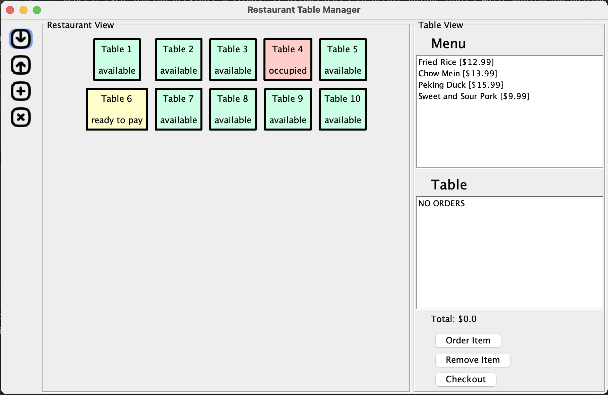

[//]: # (# My Personal Project)

[//]: # ()
[//]: # (## A subtitle)

[//]: # ()
[//]: # (A *bulleted* list:)

[//]: # (- item 1)

[//]: # (- item 2)

[//]: # (- item 3)

[//]: # ()
[//]: # (An example of text with **bold** and *italic* fonts.)

# Restaurant Table Manager

## Project Description

The Restaurant Table Manager is an application which aims to help waiters and owners keep track of tables and customer
orders at a restaurant. Restaurants should be able to upload their table layout, menus, and pricing to track current
orders, even storing previous sessions. It allows users to create unique tables while monitoring customers' orders and
spending. Users can track the state of the table from available, occupied, ready to pay, and needs cleaning.
Another feature is its ability to store restaurant layouts and previous sessions, allowing for a continuous and fluid experience.

My interest in this project stems from observing my family's previous restaurant. They would use pen, paper, and memory
to keep track of orders and manage the business's operations. Though this was not an ineffective method, their methodology
had evident issues. For one, it relied too heavily on inter-worker communication, which can be
challenging when the restaurant is experiencing a rush. The fast handwritten notes also introduces difficulties
in bookkeeping as they can often be lost, damaged, or thrown away. This application aims to mitigate these issues and
provide a solution to future staff. It establishes a central system which every worker can rely on that is less prone
to organizational or communication issues between workers. By storing previous sessions, businesses can have an easier
time tracking supplies, expenses, and even trends in their establishment. Using this app, I aim to optimize and organize
the job of restaurant waiters, such as my family.

## References
- JsonSerializationDemo-master provided by UBC CPSC 210 used as a reference for the JSON reading/writing functionality
- icons from *Softy: Squaries 64px* by Gregor Cresnar accessed at https://thenounproject.com/grega.cresnar/

## Images

